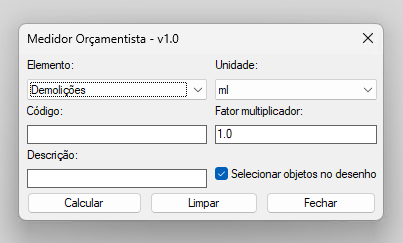

<h1 align="center">Medidor Orçamentista</h1>
<p align="center">
  
  
  
  
  
  
  
</p>

<p align="center">Este módulo permite medir automaticamente comprimentos, áreas, volumes, contagens e pesos de objetos no AutoCAD, atribuindo-os a layers específicos, alterando cores e exportando os resultados para CSV para orçamentação e controlo de obra.</p>

<p align="center">
  
</p>

---

## 🚀 Funcionalidades

- Medição de objetos por:
  - Comprimento (ml)
  - Área (m²)
  - Volume (m³) — com introdução de altura/espessura
  - Contagem de unidades (un)
  - Peso (kg) — contagem × peso unitário introduzido pelo utilizador
- Aplicação automática de **cores e layers** de acordo com a unidade de medição.
- Exportação de resultados para **CSV** (`medicoes.csv`) com cabeçalho e escapamento de aspas.
- Separador decimal configurável (`,` por defeito, compatível com Excel PT-PT).
- Fator de ajuste para resultados finais.
- Objetos não mensuráveis na unidade escolhida são ignorados (sem crash) e registados no log.
- Log de erros detalhado em `medicoes_log.txt`, criado na pasta do desenho.
- Marca de **undo** por medição — um único CTRL+Z reverte as alterações de cor/layer.
- Interface gráfica (DCL) amigável com botões de **Calcular**, **Limpar** e **Fechar**.

---

## 🛠️ Instalação

1. Copiar os ficheiros para a pasta de suporte do AutoCAD (Support Path):  

	- `medidor_orcamentista.lsp`
	- `medidor_orcamentista.dcl`

2. No AutoCAD, carregar o LISP usando o comando:

	```autocad
	APPLOAD
	```
	
	- Selecionar `medidor_orcamentista.lsp`.  

3. Ao carregar, deverá aparecer a mensagem:

	- Módulo medidor_orcamentista.lsp v1.1 carregado com sucesso. Use `MEDORC` para abrir o painel.

---

## 📋 Fluxo de Uso

1. Executar o comando no AutoCAD:

	```autocad
	MEDORC
	```

2. Selecionar o **elemento** a medir (ex: Paredes, Pavimentos).  
3. Selecionar a **unidade** (ml, m², m³, un, kg).  
4. Inserir **código**, **descrição** e **fator de ajuste** se necessário.  
5. Selecionar objetos no desenho.  
	- Em **m³**, será pedida a altura/espessura (m).  
	- Em **kg**, será pedido o peso unitário (kg/un).  
6. Ver os resultados na **linha de comando** e verificar que foram exportados para CSV.  
7. Usar os botões do DCL:
	- **Calcular**: realiza a medição e exporta resultados.
	- **Limpar**: reinicia campos do diálogo.
	- **Fechar**: fecha o diálogo.

---

## 📁 Estrutura do Código

- `medidor_orcamentista.lsp` → Código principal do módulo.  
- `medidor_orcamentista.dcl` → Interface gráfica do diálogo.  
- `medicoes.csv`             → Ficheiro gerado com os resultados das medições.  
- `medicoes_log.txt`         → Log de erros e operações realizadas.

---

## ⚙️ Configuração

- **Separador decimal do CSV**: definido pela variável `*MEDORC-DECIMAL*` no topo do `.lsp`.
	- `","` (por defeito) → compatível com Excel em Português de Portugal.
	- `"."` → formato internacional.

---

## ℹ️ Observações

- As layers de medição são criadas automaticamente caso não existam (sem alterar a layer corrente):
	- `Medido-comprimentos`
	- `Medido-areas`
	- `Medido-volumes`
	- `Medido-objectos`
	- `Medido-pesos`
- Se não forem selecionados objetos, a medição é abortada sem travar o AutoCAD.
- Se o `medicoes.csv` estiver aberto noutro programa (ex: Excel), a exportação falha de forma controlada e o erro é registado no log.
- Todos os comentários e mensagens estão em **Português de Portugal**.
- Suporta seleção múltipla de objetos.

---

## 🔧 Requisitos

- AutoCAD versão **2010 ou superior** com suporte a AutoLISP e DCL.
- Sistema operativo **Windows**.
- Permissões para criar e gravar ficheiros (`medicoes.csv`, `medicoes_log.txt`).  

---

## 🧪 Testado em

- AutoCAD 2020 e superiores.
- Ambiente Windows 10 / 11.  

---

## 📝 Changelog

### v1.1 (2026-06)
- Corrigido: `EscapeCSV` substituía apenas a primeira aspa interna; agora escapa todas.
- Corrigido: objetos não mensuráveis (ex: textos numa medição em ml) causavam erro; agora são ignorados e registados no log.
- Corrigido: a unidade **kg** estava listada mas não implementada (causava erro); agora calcula contagem × peso unitário, com layer `Medido-pesos`.
- Corrigido: comentário corrompido no código que deixava texto solto fora de comentário.
- Corrigido: exportação CSV falhava sem aviso se o ficheiro estivesse aberto noutro programa.
- Melhorado: criação de layers via `entmake` — deixa de alterar a layer corrente do desenho.
- Melhorado: handler de erros local e marcas de undo (CTRL+Z único por medição).
- Melhorado: log de erros passa a ser gravado na pasta do desenho ativo.
- Melhorado: separador decimal do CSV configurável (`,` por defeito para Excel PT-PT).
- Melhorado: variáveis locais devidamente declaradas (sem fugas para o namespace global).

### v1.0 (2025-09)
- Versão inicial.

---

## 🤝 Contribuição

Contribuições são bem-vindas — abre um *issue* ou um *pull request*.

---

### 📜 Licença

Distribuído sob a licença **MIT**. Ver o ficheiro [`LICENSE`](LICENSE) para os detalhes.
